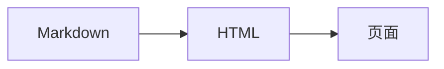

## 项目约定

本项目使用 Markdown-it 渲染 Markdown，公式使用 $KaTeX$ ，原始 HTML 不作为页面结构执行。

项目文档应使用：

- 标题、段落、强调、行内代码
- 链接、图片、列表、引用、分割线
- 表格、删除线、围栏代码块
- \$...\$ 行内公式与 \$\$...\$\$ 块级公式
- 项目图片简写：`%%相对图片路径%%`

下面这些是 Obsidian 扩展，不属于本项目 Markdown 写法：

- [[笔记名]]、![[图片名]]：改用普通 Markdown 链接或项目图片简写
- >[!NOTE]：改用普通引用 >
- ==高亮==：改用加粗或普通文本
- ^块引用、[^脚注]：当前文档不使用

## 标题与段落

```markdown
# 一级标题
## 二级标题
### 三级标题

这是一个段落。段落之间空一行。

这一行末尾加两个空格  
即可换行。
```

效果：

# 一级标题
## 二级标题
### 三级标题

这是一个段落。段落之间空一行。

这一行末尾加两个空格  
即可换行。

## 文字格式

```markdown
**加粗**
*斜体*
~~删除线~~
行内代码

反斜杠可以取消 Markdown 含义：\*不是斜体\*
```

效果：

**加粗**  
*斜体*  
~~删除线~~  
行内代码

反斜杠可以取消 Markdown 含义：\*不是斜体\*

## 链接与图片

### 链接

```markdown
[显示文字](https://example.com)
[跳到本页标题](#公式)
[打开另一篇笔记](MarkDown语言.md)
```

效果：

[显示文字](https://example.com)  
[跳到本页标题](#公式)  
[打开另一篇笔记](MarkDown语言.md)

链接文字写在方括号中，地址写在圆括号中。不使用 [[笔记名]]。

### 普通 Markdown 图片

图片路径相对于当前 Markdown 文件：

```markdown

```

效果：


### 项目图片简写

本项目还支持独特的图片代码：

```markdown
%%./images/2026-01-02_13.56.16.png%%
```

效果：

%%./images/2026-01-02_13.56.16.png%%

当图片目录与当前文档同级时，使用：

```markdown
%%./images/2026-01-02_13.56.16.png%%
```

效果：

%%./images/2026-01-02_13.56.16.png%%

本指南的图片目录位于上一级 docs_learning/images/，因此使用下面的路径进行实际测试：

```markdown
%%../images/2026-01-02_13.56.16.png%%
```

效果：

%%../images/2026-01-02_13.56.16.png%%

## 列表

```markdown
- 无序列表
- 第二项
  - 缩进一层
  - 继续缩进

1. 有序列表
2. 第二项
   1. 有序子项
   2. 另一个子项
```

效果：

- 无序列表
- 第二项
  - 缩进一层
  - 继续缩进

1. 有序列表
2. 第二项
   1. 有序子项
   2. 另一个子项

当前项目不把 Obsidian 的任务、标注和块引用语法作为文档约定；需要表达状态时直接写文字。

## 引用与分割线

```markdown
> 这是一级引用。
>
> 引用可以包含多个段落。
>
> > 这是嵌套引用。
```

效果：

> 这是一级引用。
>
> 引用可以包含多个段落。
>
> > 这是嵌套引用。

```markdown
---
```

效果：

---

## 表格

```markdown
| 项目 | 写法 | 结果 |
| --- | --- | --- |
| 加粗 | **文字** | **文字** |
| 行内代码 | 行内代码 | 行内代码 |
| 链接 | [文字](地址) | 一个链接 |
```

效果：

| 项目 | 写法 | 结果 |
| --- | --- | --- |
| 加粗 | **文字** | **文字** |
| 行内代码 | 行内代码 | 行内代码 |
| 链接 | [文字](地址) | 一个链接 |

表格第二行的短横线是表头分隔线。单元格中可以使用强调、代码和链接。

## 公式

### 行内公式

公式使用一对\$：
```markdown
勾股定理：$a^2 + b^2 = c^2$。
```

效果：

勾股定理：$a^2 + b^2 = c^2$。

### 块级公式

公式单独占行时使用一对 `$$`：
```latex
$$
\sum_{i=1}^{n} i = \frac{n(n+1)}{2}
$$
```

效果：

$$
\sum_{i=1}^{n} i = \frac{n(n+1)}{2}
$$

也可以使用 LaTeX 的成对定界符：

```markdown
\( f(x) = x^2 \)

\[
\begin{aligned}
y &= ax + b \\
\Delta y &= a \Delta x
\end{aligned}
\]
```

效果：

\( f(x) = x^2 \)

\[
\begin{aligned}
y &= ax + b \\
\Delta y &= a \Delta x
\end{aligned}
\]

公式中的`$`、反斜杠和命令交给 KaTeX 处理；公式写在代码块中时只显示代码，不会被渲染。

## 围栏代码块

代码块使用三个反引号，后面写语言标签。语言标签只影响显示与高亮，不会执行代码。

### 纯文本

```text
这是一段纯文本。
没有语言标签时，也可以按 text 处理。
```

### Markdown

````markdown
# Markdown 标题

```javascript
console.log('嵌套代码块');
```
````

### HTML

```html
<article class="card">
  <h2>标题</h2>
  <p>正文</p>
</article>
```

### CSS

```css
.card {
  display: grid;
  gap: 1rem;
  color: #1a1b21;
}
```

### JavaScript

```javascript
const greet = name => 'Hello, ' + name + '!';
console.log(greet('Markdown'));
```

### TypeScript

```typescript
type User = {
  name: string;
  active: boolean;
};

const user: User = { name: 'Ada', active: true };
```

### JSX

```jsx
export function Greeting({ name }) {
  return <h1>Hello, {name}</h1>;
}
```

### TSX

```tsx
type Props = { count: number };

export const Counter = ({ count }: Props) => (
  <button type="button">{count}</button>
);
```

### Python

```python
def square(value: int) -> int:
    return value ** 2

print(square(5))
```

### C

```c
#include <stdio.h>

int main(void) {
    printf("Hello, Markdown!\n");
    return 0;
}
```

### C++

```cpp
#include <iostream>

int main() {
    std::cout << "Hello, Markdown!\n";
    return 0;
}
```

### Java

```java
public final class Main {
    public static void main(String[] args) {
        System.out.println("Hello, Markdown!");
    }
}
```

### C#

```csharp
using System;

Console.WriteLine("Hello, Markdown!");
```

### Go

```go
package main

import "fmt"

func main() {
    fmt.Println("Hello, Markdown!")
}
```

### Rust

```rust
fn main() {
    println!("Hello, Markdown!");
}
```

### Kotlin

```kotlin
fun main() {
    println("Hello, Markdown!")
}
```

### Swift

```swift
let message = "Hello, Markdown!"
print(message)
```

### PHP

```php
<?php
echo "Hello, Markdown!";
```

### Ruby

```ruby
message = "Hello, Markdown!"
puts message
```

### SQL

```sql
SELECT name, score
FROM students
WHERE score >= 60
ORDER BY score DESC;
```

### Shell

```bash
#!/usr/bin/env bash
set -e

echo "Hello, Markdown!"
```

也可以使用 sh、shell 或 zsh 作为标签。

### JSON

```json
{
  "title": "Markdown",
  "enabled": true,
  "count": 3
}
```

### YAML

```yaml
title: Markdown
enabled: true
items:
  - heading
  - formula
```

### Diff

```diff
- old value
+ new value
```

### HTTP

```http
GET /docs/Markdown学习指南.md HTTP/1.1
Accept: text/markdown
```

### 正则表达式

```regex
^[A-Za-z0-9._%+-]+@[A-Za-z0-9.-]+\.[A-Za-z]{2,}$
```

### Mermaid 文本



Mermaid 在本项目中作为普通代码块显示，不依赖 Obsidian，也不会执行图表脚本。

## 最小模板

````markdown
# 文章标题

一句话正文，包含行内代码、*斜体* 和 **重点**。

## 公式

行内公式：$E = mc^2$

$$
\int_0^1 x^2\,dx = \frac{1}{3}
$$

## 示例

```python
print("Hello, Markdown!")
```

## 参考

- [项目主页](https://example.com)
- [回到标题](#文章标题)
````
